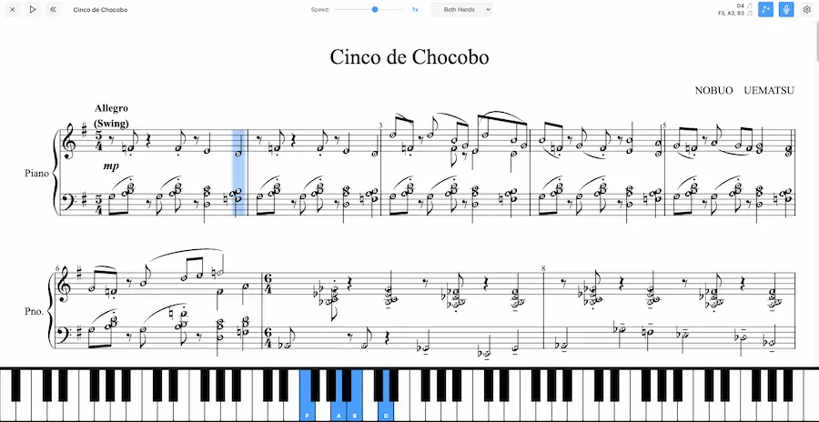

# Piano Play Along

**Live:** https://dangarfield.github.io/piano-play-along/

Browser-based piano practice app with MIDI keyboard support, real-time sheet music feedback, step-through progression, hand practice modes, and voice commands.



## Quick Start

```bash
pnpm install
pnpm dev
```

Open in Chrome, Edge, or Opera (Web MIDI API required). Connect MIDI keyboard, load a MusicXML file, and start practicing.

## Features

- **Real-time MIDI tracking** - Automatically advances when correct notes are played
- **Automatic playback** - Play button with accurate timing, tempo, and tied note handling
- **Repeat handling** - Correctly plays repeats, volta brackets (1st/2nd endings), and jumps back to repeat sections
- **Tempo extraction** - Reads tempo from MusicXML (sound elements, metronome markings)
- **Tempo control** - Adjustable playback speed (0.2x - 1.5x in 0.1x increments)
- **Practice modes** - Left hand, right hand, or both hands
- **Auto-play accompaniment** - Non-practicing hand plays automatically with correct timing
- **Voice commands** - Hands-free navigation and playback control
- **Auto-scroll** - Score follows cursor at top 1/4 of viewport
- **Key signature detection** - Automatically displays flats or sharps based on score
- **Keyboard shortcuts** - Arrow keys for note groups, Ctrl+Arrow for measures, Space for play/pause
- **Configurable UI** - Adjustable score zoom (5 levels) and keyboard size
- **Collapsible settings panel** - Right panel with settings and voice command reference
- **Note name overlay** - Optional display of note names on score (with proper accidentals)
- **Click navigation** - Click measures to jump to that position
- **Auto-save** - Restores last loaded score on page reload
- **Responsive** - Re-renders on window resize
- **Clean header UI** - Light-themed header with all controls accessible
- **Score library** - Pre-loaded collection of classical pieces and game music
- **Completion celebration** - Confetti animation when score is completed

## Tech Stack

- **TypeScript + Vite** - Build tooling
- **OpenSheetMusicDisplay** - MusicXML rendering to SVG
- **WebMidi.js** - MIDI device handling
- **Tone.js** - Audio synthesis and playback
- **Web Speech API** - Voice command recognition

## Architecture

```
src/
├── app.ts                    # Main orchestrator, component coordination
├── midi-handler.ts           # MIDI device connection & message parsing
├── score-renderer.ts         # OSMD wrapper, MusicXML parsing
├── practice-engine.ts        # Note matching & progression logic
├── playback-engine.ts        # Automatic playback with timing
├── repeat-handler.ts         # Repeat/volta bracket expansion logic
├── sound-handler.ts          # Tone.js audio synthesis
├── ui-controller.ts          # UI state updates
├── simple-keyboard.ts        # Piano keyboard visualization
└── shared/
    ├── types.ts              # TypeScript interfaces
    └── midi-utils.ts         # MIDI utilities
```

## Component Details

### app.ts
Main entry point. Initializes all components, manages state, handles user interactions.

**Responsibilities:**
- Component initialization and event wiring
- File loading (MusicXML files)
- MIDI device selection and connection
- Practice mode switching (left/right/both)
- Voice command setup and handling
- Keyboard shortcuts (arrow keys for navigation)
- Settings persistence (localStorage)
- Auto-save/restore score

**Key event handlers:**
- File input change → load score
- MIDI device select → connect device
- Practice mode select → filter notes by hand
- Zoom select → adjust score size
- Keyboard size select → adjust keyboard display
- Arrow keys → navigate note groups
- Voice commands → hands-free control

### midi-handler.ts
MIDI device management using WebMidi.js.

**Key methods:**
- `initialize()` - Request MIDI access, enumerate devices
- `selectDevice(id)` - Connect to specific MIDI input
- `onNoteOn(callback)` - Register note on event handler
- `onNoteOff(callback)` - Register note off event handler
- `onDeviceChange(callback)` - Register device connection handler

**MIDI message handling:**
- Note On: Status 144 + velocity > 0
- Note Off: Status 128 or (144 + velocity 0)
- Tracks currently pressed keys in Set

### score-renderer.ts
OpenSheetMusicDisplay wrapper for MusicXML parsing and rendering.

**Key methods:**
- `loadScore(file)` - Upload MusicXML, parse notes, render score, build repeat sequence
- `getNoteGroups()` - Extract note groups with timing/pitch/hand
- `getRepeatHandler()` - Get repeat handler instance for playback sequence
- `moveCursorToNoteGroup(index)` - Move cursor, auto-scroll to position
- `getUseFlats()` - Get key signature preference (flats vs sharps)
- `setZoom(level)` - Adjust score zoom level
- `parseKeySignatureFromOSMD()` - Extract key signature from OSMD data

**Repeat handling:**
- After loading and parsing notes, calls `repeatHandler.buildPlaybackSequence()`
- Passes OSMD instance and linear note groups to repeat handler
- Repeat handler analyzes `SourceMeasures` for repeat instructions
- Returns expanded playback sequence that engines use for correct order

**Key signature detection:**
- Reads `firstInstructionsStaffEntries[].Instructions[].keyType` from first measure
- Negative values = flats, positive = sharps
- Updates keyboard and UI to display correct accidentals

**Auto-scroll behavior:**
- Finds cursor image element by ID pattern `cursorImg-*`
- Reads cursor top position from inline style
- Scrolls to position cursor at top 1/4 of viewport
- Smooth scrolling animation

**Note extraction:**
- Iterates through `SourceMeasures` → `VerticalSourceStaffEntryContainers`
- Groups notes by timestamp (for chords)
- Assigns hand based on staff index (0=right, 1=left)
- Returns `NoteGroup[]` with measure index, timestamp, notes

### practice-engine.ts
Core practice logic. Compares played notes against expected notes, manages progression.

**State:**
- `currentPlaybackPosition` - Position in expanded playback sequence (not linear note group index)
- `currentNoteGroupIndex` - Current note group index in linear array (for cursor positioning)
- `pressedNotes` - Set of currently held MIDI notes
- `correctNotesPressed` - Set of correctly played notes in current group
- `isPlaying` - Whether practice session is active
- `score` - Array of note groups from score
- `repeatHandler` - Reference to repeat handler for sequence navigation

**Key methods:**
- `loadScore(noteGroups, repeatHandler)` - Initialize with parsed score and repeat handler
- `handleNoteOn(midiNote)` - Process MIDI note on, check progress
- `handleNoteOff(midiNote)` - Process MIDI note off
- `checkProgress()` - Compare pressed vs expected, advance if match
- `setPracticeMode(mode)` - Filter notes by hand (left/right/both)
- `jumpToNoteGroup(index)` - Navigate to specific position (finds first occurrence in sequence)
- `skipEmptyGroups()` - Auto-skip groups with no notes for selected hand
- `autoPlayOtherHand()` - Play non-practicing hand's notes automatically
- `scheduleNextAutoPlay()` - Schedule next auto-play with proper timing
- `getCurrentNoteGroupIndex()` - Convert playback position to note group index
- `getCurrentPlaybackPosition()` - Get current position in playback sequence
- `start()` - Begin practice session
- `pause()` - Pause practice session
- `reset()` - Return to beginning

**Progression logic:**
1. Filter expected notes by practice mode
2. Check if all expected notes are currently pressed
3. If match, advance playback position (not note group index)
4. Convert playback position to note group index for cursor
5. Auto-play other hand's notes with callback
6. Skip groups with no notes for active hand(s)
7. Handle tied note continuations automatically
8. Emit progress event to update UI
9. Trigger completion callback when sequence ends

**Repeat handling:**
- Uses `currentPlaybackPosition` to track position in expanded sequence
- Converts to `currentNoteGroupIndex` via `repeatHandler.getNoteGroupIndexForPosition()`
- When jumping, uses `repeatHandler.getPositionForNoteGroupIndex()` to find first occurrence
- Completion check uses `repeatHandler.getSequenceLength()` instead of note group count

### playback-engine.ts
Automatic playback with accurate timing and tied note handling.

**Key methods:**
- `loadScore(noteGroups, repeatHandler)` - Initialize with parsed score and repeat handler
- `play(startPosition)` - Start playback from playback position (not note group index)
- `stop()` - Stop playback
- `setTempo(bpm)` - Set base tempo
- `setTempoMultiplier(multiplier)` - Adjust playback speed (0.25x - 1.5x)
- `calculateTiedNoteDurations()` - Pre-calculate total durations for tied notes
- `playNextGroup()` - Schedule and play next note group

**Timing calculation:**
- Uses absolute time positions from OSMD (`localTimestamp`)
- Detects jumps (non-sequential note group indices) vs normal progression
- For jumps (repeats/volta skips): uses longest note duration in current group
- For normal progression: calculates delays using `(nextTime - currentTime) * msPerQuarterNote * 4 / multiplier`
- Handles tempo changes per measure
- Properly spaces triplets, rests, and multiple voices

**Jump detection:**
- Compares current and next note group indices
- If `nextNoteGroupIndex !== noteGroupIndex + 1`, it's a jump
- Jumps include: backward repeats, forward volta skips, any non-sequential navigation
- Uses longest note duration to ensure all notes finish before jumping

**Tied note handling:**
- Pre-calculates total duration for tied note chains
- Marks continuation notes with `isTieContinuation` flag
- First note plays with full combined duration
- Continuation notes are skipped during playback

**Repeat handling:**
- Uses `currentPlaybackPosition` to track position in expanded sequence
- Converts to note group index via `repeatHandler.getNoteGroupIndexForPosition()`
- Completion check uses `repeatHandler.getSequenceLength()`
- Progress callback receives note group index (for cursor positioning)

### sound-handler.ts
Audio synthesis using Tone.js.

**Key methods:**
- `initialize()` - Set up Tone.js synthesizer
- `playNote(pitch, duration, velocity)` - Play single note
- `stopAllNotes()` - Stop all currently playing notes

**Audio context:**
- Requires user interaction to enable (browser security)
- Shows "Click to Enable Audio" button when loading from localStorage
- Manual score selection click enables audio automatically

### ui-controller.ts
Updates UI elements based on practice state.

**Key methods:**
- `setUseFlats(useFlats)` - Set sharp/flat display preference
- `updateStatus(measure, progress, nextNotes)` - Update status panel
- `updateMidiStatus(connected, deviceName)` - Update MIDI indicator
- `updatePlayPauseButtons(isPlaying)` - Toggle pause/resume button
- `enableControls(enabled)` - Enable/disable control buttons
- `showMessage(text)` / `hideMessage()` - Show/hide loading messages

**Note name conversion:**
- Uses sharp or flat names based on key signature
- Converts MIDI note number to note name + octave
- Example: 60 → "C4" or "C4" depending on key

### simple-keyboard.ts
Piano keyboard visualization with 88 keys (A0 to C8).

**Features:**
- White keys: 20px width (normal) or 1/52 viewport width (large)
- Black keys: Positioned dynamically based on white key width
- Color coding: Yellow (next), Green (correct), Red (incorrect), White (pressed)
- Note labels: Show note names on highlighted/pressed keys
- Sharp/flat display: Adapts to key signature

**Key methods:**
- `keyDown(note, isCorrect)` - Highlight pressed key with color
- `keyUp(note)` - Remove highlight from key
- `highlightNote(note)` - Show next expected note (yellow)
- `clearHighlights()` - Clear all highlighted notes
- `setUseFlats(useFlats)` - Toggle sharp/flat display
- `destroy()` - Clean up keyboard elements

**Rendering:**
- Creates white keys first in flex layout
- Positions black keys absolutely between white keys
- Uses CSS variables for key dimensions (responsive sizing)
- Re-renders on size change to apply new dimensions

## Data Flow

### Score Loading
1. User selects MusicXML file via file input
2. `app.ts` reads file content, saves to localStorage
3. `score-renderer.ts` loads file via OSMD
4. OSMD parses MusicXML, renders to SVG
5. `score-renderer.ts` extracts note groups from OSMD data
6. `practice-engine.ts` receives note groups, initializes state
7. Key signature detected, keyboard updated to use flats/sharps
8. Auto-starts practice session

### MIDI Input Processing
1. MIDI device sends note on/off message
2. `midi-handler.ts` parses message, emits event
3. `app.ts` receives event, forwards to `practice-engine.ts`
4. `practice-engine.ts` updates pressed notes Set
5. Checks if pressed notes match expected notes
6. If match, advances to next note group
7. Emits progress event with new state
8. `app.ts` receives progress event, updates UI

### Visual Updates
1. `app.ts` receives progress event from practice engine
2. Updates `simple-keyboard.ts`:
   - Clears previous highlights
   - Highlights new expected notes (yellow)
   - Shows pressed keys (green/red)
3. Updates `ui-controller.ts`:
   - Current measure number
   - Progress percentage
   - Next notes to play
4. Updates `score-renderer.ts`:
   - Moves OSMD cursor to current position
   - Auto-scrolls to keep cursor at top 1/4

## Key Types

```typescript
interface NoteGroup {
  timestamp: number;        // Position in score (sequential)
  measureIndex: number;     // Measure number (0-indexed)
  notes: Note[];           // Notes in this group (chord or single)
}

interface Note {
  pitch: number;           // MIDI note number (0-127)
  hand: 'left' | 'right'; // Staff assignment (treble/bass)
  duration: number;        // Note length (not currently used)
  measureIndex: number;    // Measure number
  timestamp: number;       // Position in score
}

interface PracticeState {
  isPlaying: boolean;
  currentNoteGroupIndex: number;
  pressedNotes: Set<number>;
  correctNotesPressed: Set<number>;
  score: NoteGroup[];
}

type PracticeMode = 'left' | 'right' | 'both';

interface AppConfig {
  practiceMode: PracticeMode;
  zoomLevel: number;           // 0.8, 1.0, 1.25, 1.5, 1.75
  voiceCommandsEnabled: boolean;
  keyboardSize: number;        // 0 (hide), 100 (normal), 135 (large)
  showNoteNames: boolean;      // Display note names on score
  tempoMultiplier: number;     // 0.2 - 1.5 in 0.1 increments
}
```

## User Controls

### UI Controls
- **Upload MusicXML** - Open file picker to load score (header button on list page)
- **Close Score** - Return to score library
- **MIDI Device** - Select connected MIDI input device (settings panel)
- **Practice Mode** - Both Hands / Right Hand Only / Left Hand Only (header dropdown)
- **Score Zoom** - X. Small (0.8x) / Small (1.0x) / Normal (1.25x) / Large (1.5x) / X. Large (1.75x)
- **Keyboard Size** - Normal (100px) / Large (135px) / Hide
- **Show Note Names** - Toggle note name overlay on score (header button)
- **Voice Commands** - Toggle voice command recognition (header button)
- **Play/Stop** - Start/stop automatic playback (header button)
- **Tempo Slider** - Adjust playback speed (0.2x - 1.5x in 0.1x increments, default 1.0x)
- **Back to Start** - Reset to beginning of score (header button)
- **Settings Panel** - Toggle settings panel (gear icon in header)

### Keyboard Shortcuts
- **Space** - Play/pause automatic playback
- **Arrow Right** - Next note group
- **Arrow Left** - Previous note group
- **Ctrl+Arrow Right** (or Cmd on Mac) - Next measure
- **Ctrl+Arrow Left** (or Cmd on Mac) - Start of current measure (or previous if already at start)

### Mouse Controls
- **Click measure** - Jump to first note in that measure
- **Click score item** - Load score from library

### Voice Commands
Speech recognition enabled for hands-free navigation (Chrome only):

- **"measure X"** / **"bar X"** - Jump to measure number
- **"start"** - Reset to beginning
- **"back"** - Previous measure
- **"next"** - Next measure
- **"left hand"** / **"right hand"** / **"both hands"** - Change practice mode
- **"play"** - Start automatic playback
- **"stop"** - Stop automatic playback

Voice commands can be toggled on/off via the microphone button in the header.

## Settings Persistence

All settings stored in localStorage:

**Config object** (`piano-play-along-config`):
- `practiceMode` - Selected hand mode
- `zoomLevel` - Score zoom level (default: 1.25)
- `voiceCommandsEnabled` - Voice command state (default: true)
- `keyboardSize` - Keyboard display size (default: 135)
- `showNoteNames` - Note name overlay toggle (default: false)
- `tempoMultiplier` - Playback speed adjustment (0.2x - 1.5x, default: 1.0x)

**Score data** (`piano-play-along-saved-score`):
- Last loaded MusicXML content (auto-restores on page load)

## Development Notes

### Adding Features
- **MIDI features**: Extend `midi-handler.ts`
- **Practice modes**: Modify `practice-engine.ts` filtering logic
- **UI changes**: Update `ui-controller.ts` and `index.html`
- **Score parsing**: Modify `score-renderer.ts` note extraction
- **Voice commands**: Extend `app.ts` `handleVoiceCommand()`

### Common Tasks
- **Change note matching**: Edit `practice-engine.ts` `checkProgress()`
- **Modify keyboard**: Edit `simple-keyboard.ts` rendering methods
- **Adjust auto-scroll**: Edit `score-renderer.ts` `scrollCursorIntoView()`
- **Change hand assignment**: Modify `score-renderer.ts` staff detection

### Key Implementation Details

**Key signature detection:**
- Path: `osmd.Sheet.SourceMeasures[0].firstInstructionsStaffEntries[].Instructions[].keyType`
- Negative values indicate flats, positive indicate sharps

**Cursor positioning:**
- Cursor image ID pattern: `cursorImg-*`
- Position read from inline `style.top` attribute
- Scrolls to position cursor at top 1/4 of viewport

**Keyboard sizing:**
- Normal: Fixed 20px white key width
- Large: `calc(100vw / 52)` for 52 white keys across viewport
- Uses CSS variables for responsive sizing

### Known Limitations
- Requires Chromium-based browser (Web MIDI API)
- Hand assignment based on staff only (treble=right, bass=left)
- No recording of practice sessions
- Voice commands only work in Chrome
- MIDI input disabled during automatic playback

## Browser Compatibility

**Supported:**
- Chrome/Chromium (recommended)
- Edge (Chromium-based)
- Opera

**Not Supported:**
- Firefox (no Web MIDI API)
- Safari (no Web MIDI API)

## Future Enhancements

- Metronome/click track
- Recording of practice sessions
- Progress tracking and statistics
- Loop sections
- Transpose functionality
- Timing enforcement mode
- Multiple voice support (beyond treble/bass)
- Keyboard click to emulate MIDI input


### repeat-handler.ts
Handles repeat logic for music playback by parsing OSMD repetition data and creating an expanded playback sequence.

**Key concepts:**
- **Linear note groups**: Original sequential array of note groups from score (no repeats expanded)
- **Playback sequence**: Expanded array of `PlaybackStep` objects that includes repeated sections
- **PlaybackStep**: `{ noteGroupIndex, measureIndex, repetitionIteration }` - maps playback position to note group

**Key methods:**
- `buildPlaybackSequence(osmd, noteGroups)` - Main entry point, analyzes score and builds sequence
- `parseRepetitionInstructions(sourceMeasures)` - Extracts repeat info from OSMD SourceMeasures
- `buildSequenceFromRepeatInfo(repeatInfo)` - Expands repeats into playback order
- `getPlaybackSequence()` - Returns the expanded sequence
- `getSequenceLength()` - Total steps in playback (includes repeats)
- `getNoteGroupIndexForPosition(position)` - Convert playback position to note group index
- `getPositionForNoteGroupIndex(noteGroupIndex)` - Find first occurrence of note group in sequence

**Repeat parsing:**
- Checks `SourceMeasure.beginsWithLineRepetition()` for forward repeat barlines (start)
- Checks `SourceMeasure.endsWithLineRepetition()` for backward repeat barlines (end)
- Checks `SourceMeasure.beginsRepetitionEnding()` for volta brackets
- Reads `FirstRepetitionInstructions[0].endingIndices` for volta numbers ([1], [2], etc.)
- Handles volta brackets that span multiple measures
- Detects when backward repeat measure is also a volta ending (volta 2)

**Sequence building:**
- Iterates through measures, detecting repeat sections
- For each repeat: plays common section, then appropriate ending for each iteration
- Volta 1 played on first iteration, volta 2 on second iteration, etc.
- Skips measures already processed (inside repeats)
- Handles repeats without explicit start (implicit from beginning)

**Data structures:**
```typescript
interface PlaybackStep {
  noteGroupIndex: number;      // Index into linear noteGroups array
  measureIndex: number;         // Visual measure number
  repetitionIteration: number;  // Which iteration (0=first, 1=second)
}

interface RepeatSection {
  startMeasure: number;         // Measure with forward repeat
  endMeasure: number;           // Measure with backward repeat
  repeatCount: number;          // How many times to play (default 2)
  endings: VoltaEnding[];       // Volta brackets
}

interface VoltaEnding {
  startMeasure: number;         // First measure of ending
  endMeasure: number;           // Last measure of ending
  iterations: number[];         // Which iterations [1], [2], etc.
}
```

**Example:**
- Linear: measures 1-2-3-4-5-6-7-8-9-10-11-12
- Repeat: 3-10 with volta 1 (measure 10), volta 2 (measure 11)
- Sequence: 1-2-3-4-5-6-7-8-9-10(volta1)-3-4-5-6-7-8-9-11(volta2)-12
- Playback positions: 0-1-2-3-4-5-6-7-8-9-10-11-12-13-14-15-16-17-18
- Note group indices: 0-1-2-3-4-5-6-7-8-9-2-3-4-5-6-7-8-10-11

**Integration:**
- Called by `score-renderer.ts` after parsing notes
- Passed to `practice-engine.ts` and `playback-engine.ts` via `loadScore()`
- Engines use playback positions internally, convert to note group indices for cursor/UI
- Clicking measures finds first occurrence in sequence
- Completion checks use sequence length, not note group count
